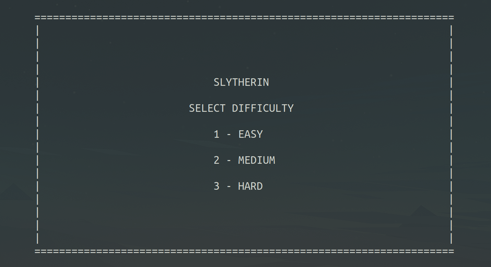
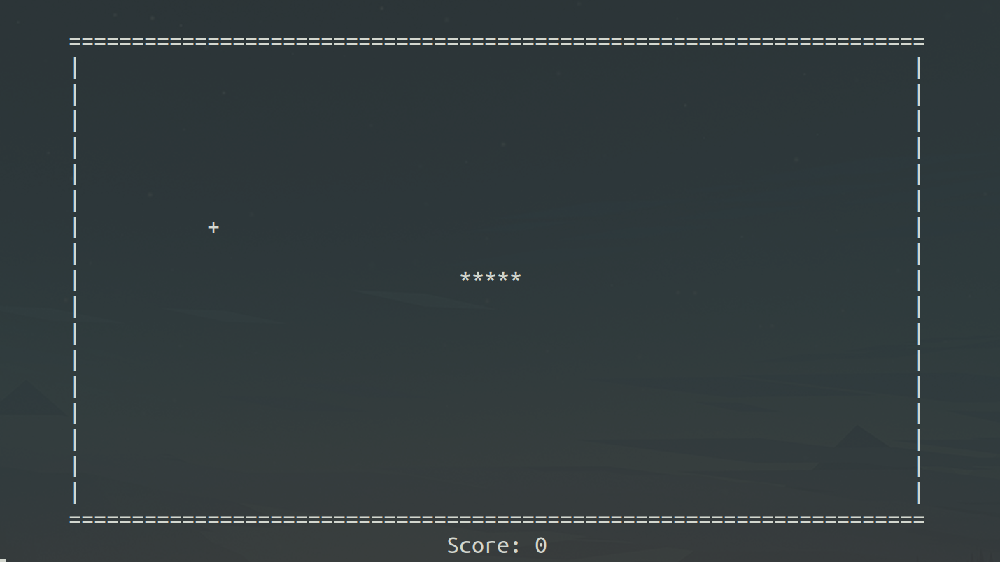
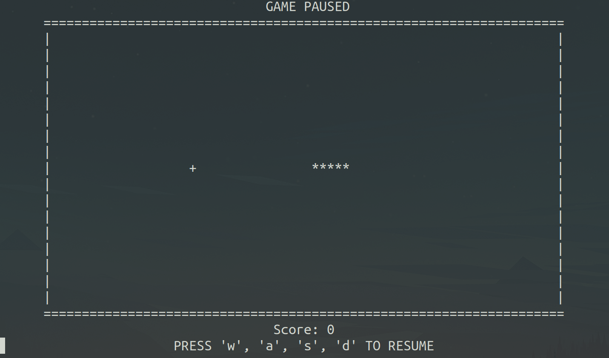
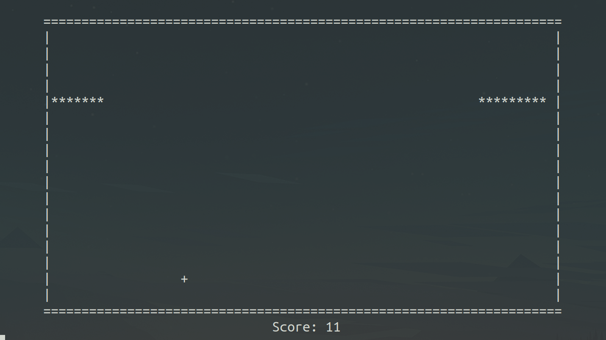
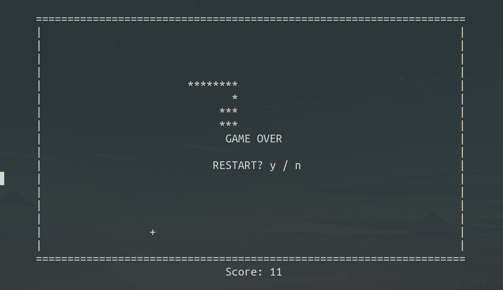

# Slytherin

Students: Yehya Albakri

#

## Project goal

For this project, I wanted to create my version of the game of Snake, called Slytherin. I didn't really understand the knowledge requirements for approaching this, so that became one of my first tasks. The great thing about this project is that the scope can be easily modified depending on how comfortable I'm feeling with the tools I have. To start, I set my scope as a MVP (just a snake moving around, eating food that is randomly generated) and slowly add features as I get through my tasks. To my surprise, this approach worked out very well. Breaking the project down into tasks made it so much more achievable.

What I ended up creating was a game with many of the additional features I had hoped to get to. These include score-keeping, going through walls, various difficulties, prompt to restart after game over, making food generation avoid snake tail, and a pause / resume feature. It felt like an actual game I would play.

#

## Learning Goals

I had three main learning goals for this project. The first is to get better at C programming. Software Systems is my first introduction to C programming and I have been introduced to so many new concepts that I never considered before. This project was an opportunity for me to dive in and explore.

This leads me to my second learning goal, to understand how pointers work. Python abstracts data structures very well and I've never had to think about how exactly that works. C allowed me to explore in more detail how arrays and doubly-linked-lists can be created and stored using pointers. Because I was forced to use and experiment with pointers, I got the opportunity to explore and understand how they work.

My third learning goal is to get better at efficient programming. There are multiple ways to implement a game of Snake, some of which are very taxing and inefficient. Something I consciously strived to do is think of more efficient approaches throughout my implementation.

#

## Resources Used

In terms of my approach, the main resource that I used as a reference is this GitHub implementation of a doubly-linked-list: https://gist.github.com/mycodeschool/7429492

Otherwise, before I started, I had just watched random tutorials of different approaches to implement Snake. I didn't reference or use them in my code in any way though.

Finally, I used a version of the "conio.h" package that allowed me to scan keyboard input without interrupting the user. Here's the link to the source:
https://github.com/zoelabbb/conio.h

#

## Achievements

By the end of the project, I was able to finish what I had originally set out to do in addition to some additional features. My final implementation includes a doubly-linked-list as the main Snake object with attributes of prev, next, and the x and y positions of each node. The list itself is defined by a head and tail that are pointers to the first and last node of the snake. Below are some functions I defined and explanations of what they do.

```
void insertAtHead(int x, int y) /* Inserts head to the snake at 'x' and 'y' positions */

void pop() /* Pops snake's tail (occurs at each frame) */

void deleteSnake() /* Runs pop on the entire snake then clears the head and tail. Used at game over when player is given the option to restart. */

void print() /* Iterates through the nodes of the snake and prints at their x and y positions. */

void load() /* Generates Game's frame. */

int food_x() /* Generates a food at the x coordinate */

int food_y() /* Generates a food at the y coordinate */

int selfCollision() /* Returns 1 if the snake collides with itself, 0 otherwise. */

char gameOver() /* Provides a Game Over screen and returns 'y' or 'n'. */

int intro() /* Intro screen, returns difficulty selected by player. */
```

The game works by popping the tail of the snake and adding a new head at each frame of the game. As the game progresses, the framerate gradually increases with the score, eventually plateauing. There are various checks throughout the main function that check if any specific event has occurred such as the snake eating the food or colliding with itself.
<br/>
<br/>
Below are some photos of the various features implemented in the game.

### Intro Screen



### Game Start



### Game Paused



### Snake Passing Through Wall



### Game Over



#

## Design Decisions

The most important design decision I had to make was choosing the method for defining and displaying the snake object. To define the snake, I used a doubly-linked-list and to display it, I found a method to print at coordinates of the terminal using C. I defined it as a function 'printToCoordinates(y, x, text)'. This way, both the display and snake are independent, allowing for much more freedom in displaying other things such as the food, splashscreen, and score. The other approach to displaying the snake was creating a 2D array of all the spaces in a block of the terminal and modifying it depending on the previous frame. I chose my method because I believed it was more efficient and much easier to manipulate for additional features. Another design decision was to make the head and tail nodes of the snake just global variables. This allowed for much easier access and manipulation throughout any function in my code as I didn't have to pass the snake as a parameter.

#

## Code Snippets

The following is how the game recieves controls from the keyboard. If any key is pressed, the switch function updates the variable 'c' with the current key. There are if statements to check if the new key pressed is the opposite direction of current movement to make sure the snake does not move backward onto itself.

```
if (c_kbhit() != 0)
        {
            switch (c_getch())
            {
            case 'w':
                if (c != 's')
                {
                    c = 'w';
                }
                break;
            case 'a':
                if (c != 'd' && c != 'o')
                {
                    c = 'a';
                }
                break;
            case 's':
                if (c != 'w')
                {
                    c = 's';
                }
                break;
            case 'd':
                if (c != 'a')
                {
                    c = 'd';
                }
                break;
            case 'p':
                c = 'p';
            }
        }
```

The following places a new node of the snake in the direction of movement and pops the tail. This updates at each frame.

```
switch (c)
        {
        case 'w':
            insertAtHead(temp->x - 1, temp->y);
            pop();
            break;
        case 'a':
            insertAtHead(temp->x, temp->y - 1);
            pop();
            break;
        case 's':
            insertAtHead(temp->x + 1, temp->y);
            pop();
            break;
        case 'd':
            insertAtHead(temp->x, temp->y + 1);
            pop();
            break;
        case 'p':
            printToCoordinates(0, 36, "GAME PAUSED");
            printToCoordinates(22, 24, "PRESS 'w', 'a', 's', 'd' TO RESUME");
        }
```

The following shows what happens when the snake eats a food block. The speed of the snake increases and the length increases. speed_decrement and max_speed_delay are decided when the player chooses the game difficulty.

```
if (speed > max_speed_delay)
            {
                speed -= speed_decrement; /* Increases snake speed at each bite */
            }
            length += 1;
            switch (c)
            {
            case 'w':
                insertAtHead(temp->x - 2, temp->y);
                break;
            case 'a':
                insertAtHead(temp->x, temp->y - 2);
                break;
            case 's':
                insertAtHead(temp->x + 2, temp->y);
                break;
            case 'd':
                insertAtHead(temp->x, temp->y + 2);
                break;
```

In the final snippet, this block checks if the snake has collided with itself. This prompts the game over screen.

```
if (selfCollision() == 1)
        {
            print(); /* prints the snake */
            printToCoordinates(21, 37, score);
            load(); /* prints the frame */
            if (gameOver() == 'y')
            /* restarts game if player enters 'y' when prompted */
            {
                deleteSnake();
                main();
            }

            printToCoordinates(21, 37, score);
            break;
        }
```

#

## Reflection

I believe I have achieved the upper bound of what I set out to do. Breaking the project into snippets that I can tackle made it much more achievable and motivating to do so. I consistently added small features where I saw fit, eventually making the game much more complete than I had originally imagined. I believe I did achieve my learning goals. I feel much more comfortable working in C and have a much better understanding of how pointers work.
